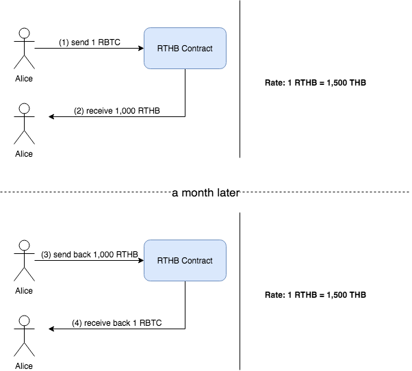

# Thai Baht Coin backed by BTC
This project is the proof of concept for securely issuing Thai Baht Stable Coin named RTHB, which is backed by Bitcoin (BTC).

## Introduction
In the fiat currency world, the unit of money is typically backed by gold. Meanwhile, Bitcoin is like a new gold standard in the cryptocurrency. That is why we decided to do this project in order to prove that we can issue a stable coin in the unit of Thai Baht (we call RTHB) which is backed by Bitcoin. This project is just a proof of concept. There are several issues we do not cover or prove in this demonstration such as regulation proofs or practical use scenario proofs.

## How it works?
In Bitcoin ecosystem, there is an interesting sidechain platform called [RSK project (rootstock)](https://www.rsk.co/). RSK platform enables us develop EVM(Ethereum Virtual Machine) based smart contract in order to interact with BTC (they call RBTC in RSK platform). With the smart contract feature enabled, we can put some special business logics against Bitcoin ecosystem easily.

Our RTHB is an ERC20-compatible token with extra following features.
1. Anyone can invoke the function **issue()** along with the collateral RBTC and then get RTHB back. By default, the amount of RTHB would be issued as the proportion 1:1.5 (~66.67%) of the collateralized RBTC (this proportion is adjustable).
2. RTHB holders can freely transfer any amount of RTHB to anyone.
3. An owner of RTHB contract, who did the transaction (1), can switch back his/her fund to RBTC by way of invoking the function **claim()** along with the same amount of RTHB as specified in the contract.
4. In case the RBTC price drops which makes RBTC price on a specific contract less than or equal to 130% of the collateralized RBTC, the contract is open for the public to take over. Thus, anyone can call to the function **publicTakeover()** together with the amount of RTHB calculated by the equation: RTHB >= targetContract.RBTC * currentRate, to take over the contract and take away the collateralized RBTC.

## Example scenarios of RTHB
### Scenario 1 - RBTC price is stable

1) Alice send 1 RBTC at curret rate 1,500 THB/BTC to RTHB Smart Contract (calling **issue()**).
2) Alice receive 1,000 RTHB back (at 1.5:1 ratio).
3) Alice decide to return back 1,000 RTHB to get her RBTC back (calling **claim()**).
4) Fortunately the rate's very stable, so the RTHB Smart Contract retur her 1 RBTC back.

### Scenario 2 - RBTC price is increasing

### Scenario 3 - RBTC price is decreasing

## To-do
- Implement some missing ERC20 functions.
